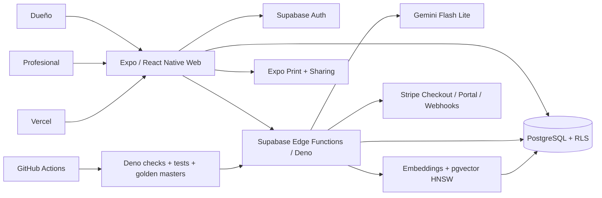

# K9 Behavioral Architect — Tech Stack y Arquitectura

**Versión:** 1.0  
**Corte de información:** 22 de agosto de 2026  
**Audiencia:** ingeniería, due diligence técnica, CTO futuro e inversores técnicos.

## 1. Arquitectura resumida



El producto es un cliente universal Expo con dos experiencias por rol, respaldado por Supabase. La lógica sensible y los límites viven en servidor/SQL; el cliente refleja permisos pero no es autoridad.

## 2. Frontend

| Capa | Tecnología actual | Uso |
|---|---|---|
| Runtime | React 19.2.5 | Composición de interfaz. |
| Multiplataforma | React Native 0.83.4 + React Native Web 0.21 | Componentes compartidos. |
| Framework | Expo 55 | Desarrollo y builds web/nativos. |
| Navegación | Expo Router 55 con typed routes | Rutas públicas, dueño y profesional. |
| Lenguaje | TypeScript 5.9 | Tipado del cliente. |
| Iconos | Lucide React Native | Iconografía del sistema. |
| Sesión local | Expo SecureStore / adaptador web | Persistencia de autenticación. |
| PDF | Expo Print + Expo Sharing | Generación/compartición de informes. |
| Tipografía | Space Grotesk + JetBrains Mono | Sistema visual. |

### Distribución

- **Web:** export estático de Expo alojado en Vercel.
- **Android/iOS:** configuración Expo/EAS presente, identificadores nativos definidos.
- **Estado:** no existe evidencia en esta documentación de publicación pública en App Store/Google Play. El perfil EAS visible solo define un APK `preview` para Android.

La autenticación funcional del cliente es correo/contraseña; los manejadores de OAuth de Google y Apple están vacíos. La creación de Checkout está limitada a web y rechaza la plataforma nativa.

### Navegación por rol

- Público: login, signup, invitaciones y Biblioteca.
- Dueño: tabs Hoy/Planes/+/Biblioteca/Perfil.
- Profesional: sidebar en escritorio y barra de campo en pantallas pequeñas.
- El guard de rol evita que una cuenta entre en el shell que no le corresponde.

El guard actual separa por `account_type`; no utiliza `hasProSuite` como compuerta de navegación. Las operaciones costosas sí se limitan en servidor, pero conviene auditar si todas las superficies Pro deben permanecer visibles en modo lectura o ante una combinación de tier/rol inconsistente.

## 3. Backend y datos

### Supabase

K9 utiliza:

- Supabase Auth.
- PostgreSQL.
- Row Level Security.
- Edge Functions sobre Deno.
- funciones SQL/RPC para operaciones sensibles y consumo atómico de cupos.
- `pgvector` para recuperación semántica.

### Entidades principales

| Área | Tablas principales |
|---|---|
| Identidad | `profiles`, `subscriptions` |
| Conducta | `dogs`, `behavior_goals`, `abc_records`, `shaping_plans`, `sessions` |
| Profesional | `clients`, `appointments`, `plan_step_edits` |
| Vinculación | `client_invitations`, `connection_requests` |
| Consulta IA | `consulta_hilos`, `consulta_turnos` |
| Corpus | `sources`, `rag_documents`, `rag_query_log`, `library_docs` |
| Facturación técnica | `stripe_webhook_events`, `billing_migration_markers` |

### Modelo de seguridad

- Tablas con RLS y políticas por propietario.
- Políticas adicionales para acceso del profesional a clientes vinculados.
- RPCs de invitación/conexión para validar estado y consentimiento.
- Triggers de base de datos para límites de perros/casos.
- Consumo de generaciones/consultas en operaciones atómicas del servidor.
- Soft delete en entidades clínicas relevantes.

La app no debe confiar en ocultar botones como mecanismo de seguridad. Los límites y permisos se vuelven a comprobar en servidor o base de datos.

Existe deuda de modelo en la relación profesional: `dogs` no contiene un `client_id` directo y parte de la asociación caso–cliente se deriva mediante citas y conexiones. Es suficiente para los flujos actuales, pero debe normalizarse antes de presentar K9 como CRM multiempresa maduro.

## 4. Edge Functions

| Función | Responsabilidad |
|---|---|
| `generate-plan` | Conversación de entrada, evaluación funcional, planificación, revisión pedagógica, Welfare Reviewer y persistencia. |
| `process-session-report` | Procesa el reporte y aplica la regla determinista de progresión/seguridad. |
| `rag-query` | Embedding, búsqueda vectorial, diversificación y logging de recuperación. |
| `consulta-ia` | Hilos informativos, anclaje, recuperación, redacción por rol, bandera roja y lecturas recomendadas. |
| `tidy-dictation` | Limpia y estructura texto dictado. |
| `edit-plan-step` | Ajuste profesional validado y auditado. |
| `create-checkout` | Crea Stripe Checkout desde tier/intervalo permitido. |
| `stripe-webhook` | Reconcilia eventos de Stripe e idempotencia. |
| `create-portal-session` | Abre el portal de gestión de facturación. |

Las funciones se despliegan con `--no-verify-jwt`; las de usuario comprueban autenticación en código. El webhook usa la firma criptográfica de Stripe.

## 5. Capa de IA

### Proveedor y modelos

- Proveedor único actual: Google Gemini.
- Modelo generativo por defecto documentado: `gemini-3.1-flash-lite`, configurable con `GEMINI_MODEL`.
- SDK usado en Edge Functions: `@google/generative-ai` 0.24.1.
- Embeddings: `gemini-embedding-001`, reducidos a 768 dimensiones.

Los nombres de modelo deben leerse de configuración/ADR vigente; los TSD históricos contienen nombres sustituidos.

### Diseño del motor

El motor no es LangGraph en producción. La orquestación actual está implementada como pipeline explícito de Edge Functions y llamadas secuenciales con validadores, reintentos sujetos a presupuesto de tiempo y trazabilidad en `agent_metadata`.

Esta precisión es importante para due diligence: LangGraph aparece en especificaciones históricas, pero no debe listarse como dependencia actual.

### Contratos y validación

- Tipos compartidos en `_shared/types.ts`.
- Validadores estructurales antes de aceptar salidas de modelo.
- Reglas deterministas separadas del LLM.
- Presupuesto de tiempo que puede omitir reintentos opcionales, no el veto final de bienestar.
- Telemetría por agente y registro de contexto RAG usado.

## 6. RAG y corpus

```text
consulta → gemini-embedding-001 (768d) → match_documents()
→ índice HNSW/coseno → diversificación por fuente → chunks → redacción
```

- PostgreSQL `pgvector` como almacén vectorial.
- Índice actual HNSW con `vector_cosine_ops`; IVFFlat queda como referencia histórica en comentarios/TSD antiguos.
- Corpus organizado en fuentes y fragmentos, con curación por tiers.
- Evaluación mediante harness RAGAS y casos de recuperación.
- Biblioteca pública separada, relacionada mediante taxonomía.

### Deuda de calidad conocida

- Consulta IA todavía no tiene un eval set equivalente al del generador de planes.
- El aumento de chunks por fuente para Consulta IA no está medido con RAGAS.
- Parte de la metadata de autor/año del corpus requiere saneo antes de presentarse sin filtros al usuario.
- El RAG del generador es fail-soft; un fallo no bloquea necesariamente el plan.

## 7. Motor determinista de progresión

Reglas centrales en `_shared/behavioralDoctrine.ts` y `process-session-report/rules.ts`:

- avance: `> 0.8`;
- división: `< 0.5` salvo reducción de D;
- meseta: 3 sesiones y varianza `< 0.01`;
- una D por paso;
- estrés puede impedir avance;
- incidente grave produce `SAFETY_HOLD`.

Separar estas reglas del LLM reduce variabilidad y permite tests sin red.

## 8. Facturación

- Stripe Checkout alojado.
- Stripe Billing Portal.
- Catálogo de seis combinaciones tier/intervalo configurado solo en servidor.
- Webhook firmado e idempotencia mediante `stripe_webhook_events`.
- Estados: `trialing`, `active`, `past_due`, `canceled`, `incomplete`, más exención propia.
- Modo lectura y red de seguridad por periodo vencido.
- Cupos mensuales con renovación perezosa; no depende de cron.

Existe prueba completa de checkout para una cuenta Pro. Falta evidencia equivalente de los otros cinco precios y de los eventos de actualización, cancelación e impago en el dashboard.

El código del Billing Portal existe, pero Stripe requiere una configuración externa activa. Sin ella, crear una sesión real puede fallar aunque la Edge Function esté desplegada.

## 9. Voz

### Implementado

- Entrada y salida web con Web Speech API en navegadores compatibles.
- Limpieza semántica del dictado mediante `tidy-dictation`.

Aunque K9 no persiste archivos de audio en su esquema, en web el reconocimiento puede ser procesado por el navegador o su proveedor. Por ello no debe afirmarse que “todo el audio se procesa localmente” sin una verificación específica por navegador y plataforma.

### Diseñado pero no implementado en el cliente actual

- STT nativo mediante `@react-native-voice/voice`.
- TTS nativo mediante `expo-speech`.

Esas dependencias no figuran en `app/package.json`. La arquitectura de voz nativa es una decisión documentada, no una capacidad actual.

## 10. Informes y contenido público

- Informes construidos en HTML y exportados a PDF mediante Expo Print.
- Marca textual del negocio.
- Biblioteca y landings servidas como recursos públicos junto a la exportación web.
- Rewrites de Vercel para rutas estáticas de Biblioteca y fallback de SPA.

No existe pipeline de carga/gestión de logotipos ni bucket asociado.

## 11. CI/CD y calidad

GitHub Actions ejecuta:

1. `deno check` sobre las Edge Functions listadas.
2. Tests deterministas sin red para reglas, validadores, permisos, Stripe, consulta y coherencia de mirrors.
3. Golden masters reales contra Gemini para Welfare Reviewer, clasificador de seguridad y redacción de Consulta IA cuando existe `GEMINI_API_KEY`.
4. Despliegue de Edge Functions a Supabase si los jobs anteriores pasan.
5. Estampado del SHA desplegado en `_shared/version.ts`.

Limitación: si falta `GEMINI_API_KEY`, los golden masters se ignoran y el job pasa. Además, el listado de funciones a desplegar es manual; una función nueva debe añadirse expresamente al workflow.

Vercel construye el frontend web mediante `expo export --platform web`.

## 12. Dependencias externas críticas

| Proveedor | Dependencia | Riesgo/mitigación |
|---|---|---|
| Supabase | Auth, DB, RLS, Edge Functions | Alto acoplamiento; migraciones y políticas auditables. |
| Google Gemini | Generación y embeddings | Modelo configurable; proveedor único reduce complejidad pero concentra riesgo. |
| Stripe | Suscripciones | Webhook firmado, reconciliación e idempotencia. |
| Vercel | Hosting web | Export estático portable, pero rutas/rewrite deben verificarse. |
| APIs de voz del navegador | Dictado web | Compatibilidad desigual; interfaz debe degradar a texto. |

## 13. Configuración sensible

Variables/secrets relevantes incluyen:

- Supabase URL y clave pública para el cliente.
- `GEMINI_API_KEY`, `GEMINI_MODEL`.
- `APP_BASE_URL`.
- `STRIPE_SECRET_KEY`.
- seis `STRIPE_PRICE_*`.
- `STRIPE_WEBHOOK_SECRET`.
- credenciales de despliegue de Supabase en GitHub Actions.

No registrar valores reales en documentación, logs ni capturas.

## 14. Riesgos técnicos prioritarios

1. **Distribución nativa no demostrada:** compilar/publicar/verificar iOS y Android.
2. **Voz nativa ausente:** cerrar diferencia entre arquitectura y copy.
3. **Promesas Estudio desalineadas:** flags de seats/white-label/CV existen sin experiencia operativa.
4. **Cobertura Stripe incompleta:** verificar catálogo y tres eventos restantes.
5. **Legal/privacidad:** políticas, cookies y revisión de afirmaciones RGPD.
6. **Calidad de Consulta IA:** eval set, verificación de citas y saneo de metadata.
7. **Observabilidad:** consolidar alertas de fallos de IA, webhooks y seguridad; los logs actuales no equivalen a monitorización operativa completa.
8. **SMTP:** configurar proveedor propio para mejorar confirmaciones en dominios corporativos.
9. **Gobierno de datos:** diseñar y verificar eliminación de cuenta, exportación/rectificación y procedimiento operativo para derechos del usuario.
10. **Modelo profesional/CRM:** hacer explícita y auditable la relación caso–cliente y diseñar aislamiento por organización antes de equipos o multiestudio.

## 15. Fuentes primarias

- Dependencias: [`app/package.json`](../../app/package.json).
- Builds: [`app/app.json`](../../app/app.json), [`app/eas.json`](../../app/eas.json), [`vercel.json`](../../vercel.json).
- CI/CD: [`.github/workflows/deploy-edge-functions.yml`](../../.github/workflows/deploy-edge-functions.yml).
- Datos: [`supabase/migrations`](../../supabase/migrations/).
- IA: [`ADR-001`](../decisions/ADR-001-claude-sonnet-only.md), [`ADR-002`](../decisions/ADR-002-gemini-embeddings-rag.md), [`ADR-006`](../decisions/ADR-006-hnsw-vector-index.md).
- Producto: [`PRODUCT-REFERENCE.md`](./PRODUCT-REFERENCE.md).
